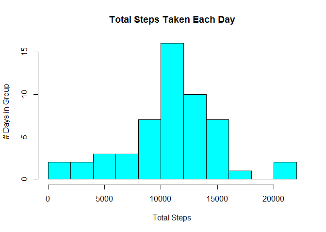
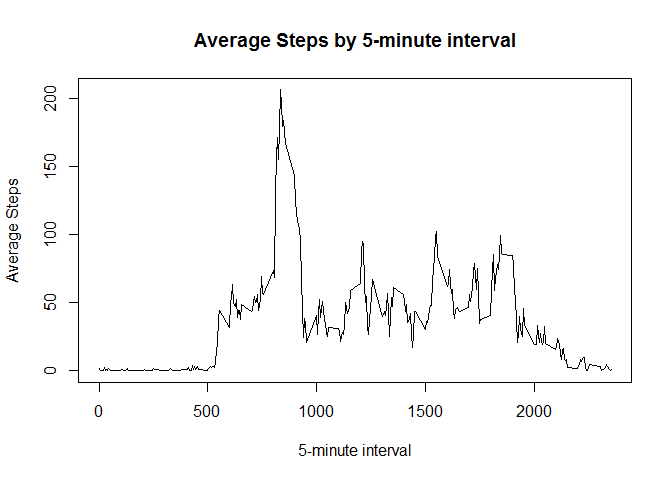
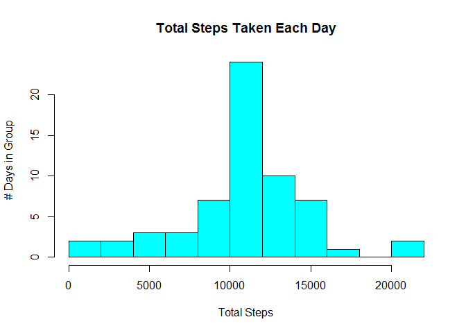
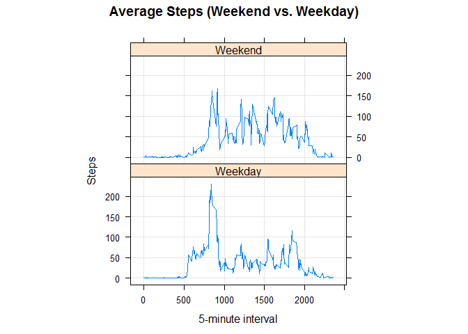

# Reproducible Research: Peer Assessment 1


## Loading and preprocessing the data
* Make sure the latest data set is downloaded if it has been updated at the source.
* Filtering data using complete.cases to make sure all rows have valid data.

```r
sourceZip <- "https://d396qusza40orc.cloudfront.net/repdata%2Fdata%2Factivity.zip"
targetZip <- "activity.zip"
sourceFile <- "activity.csv"
download.file(sourceZip, targetZip)
unzip(targetZip)

sourceData <- read.csv(sourceFile)
filteredData <- sourceData[complete.cases(sourceData),]
```


## What is mean total number of steps taken per day?
First, we will check the dispersion of data using a histogram with 10 breakpoints.  Using the filtered result set and aggregating the total by day.

```r
stepsByDay <- aggregate(filteredData$steps, by=list(filteredData$date), FUN=sum)
hist(stepsByDay$x, 
     main="Total Steps Taken Each Day", 
     xlab="Total Steps", 
     ylab="# Days in Group", 
     col="cyan", 
     breaks=10
)
```

<!-- -->

Now, let's get the mean and median of the total steps per day.

```r
stepsMean <- format(mean(stepsByDay$x), digits=2)
stepsMedian <- median(stepsByDay$x)
```
* Mean = **10766**
* Median = **10765**


## What is the average daily activity pattern?
Using a time series plot of the 5-minute intervals and average number of steps taken across all days

```r
stepsAveraged <- aggregate(filteredData$steps, by=list(filteredData$interval), FUN=mean)
plot(x=stepsAveraged$Group.1, 
     y=stepsAveraged$x,
     type="l",
     xlab="5-minute interval",
     ylab="Average Steps",
     main="Average Steps by 5-minute interval"
)
```

<!-- -->

Next, finding which 5-minute interval averaged the most steps across all days in the data set

```r
maxInterval <- stepsAveraged[which.max(stepsAveraged$x),]$Group.1
```
* Highest 5-minute interval = **835**

## Imputing missing values
How many NA values were removed from the original source data?  Let's get a full result set of incomplete rows for later use.

```r
missingData <- sourceData[!complete.cases(sourceData),]
missingCount <- nrow(missingData)
```
* The number of rows removed from the original source = **2304**

Let's update the missing data with the mean from the steps by interval data set that we calculated earlier and merge with the filtered set of complete.cases.

```r
for (i in 1:nrow(missingData)) {
    missingData$steps[i] <- stepsAveraged$x[which(missingData$interval[i] == stepsAveraged$Group.1)]
}

finalData <- rbind(filteredData, missingData)
```
Now, we will take the total steps by day and create a similar histogram with the missing data filled from the average steps by interval.

```r
finalSum <- aggregate(finalData$steps, by=list(finalData$date), FUN=sum)

hist(finalSum$x, 
     main="Total Steps Taken Each Day", 
     xlab="Total Steps", 
     ylab="# Days in Group", 
     col="cyan", 
     breaks=10
)
```

<!-- -->

Let's see if we have changes in the mean and median with the new, imputed data set.

```r
fullMean <- format(mean(finalSum$x), digits=2)
fullMedian <- format(median(finalSum$x), digits=2)
```
* Mean = **10766**
* Median = **10766**

As we can see, there is essentially no difference between using the mean to fill in missing values versus removing them altogether.  While the median is 1 step closer to the mean (as expected), it is not material in the final results.


## Are there differences in activity patterns between weekdays and weekends?
Using a panel plot and the imputed data from the prior computations, let's compare the average number of steps per 5-minute interval between weekdays and weekends and see if one shows a higher step rate.


```r
library(lattice)

finalData$DayOfWeek <- weekdays(as.Date(finalData$date)) 
finalData$WeekPart <- ifelse(finalData$DayOfWeek %in% c("Saturday", "Sunday"),"Weekend","Weekday")

stepsAveraged <- aggregate(finalData$steps, by=list(finalData$interval, finalData$WeekPart), FUN=mean)

xyplot(x ~ Group.1 | factor(Group.2), 
       data = stepsAveraged, 
       aspect = 1/2, 
       type = "l",
       xlab="5-minute interval",
       ylab="Steps",
       main="Average Steps (Weekend vs. Weekday)",
       grid=TRUE
  )
```

<!-- -->
